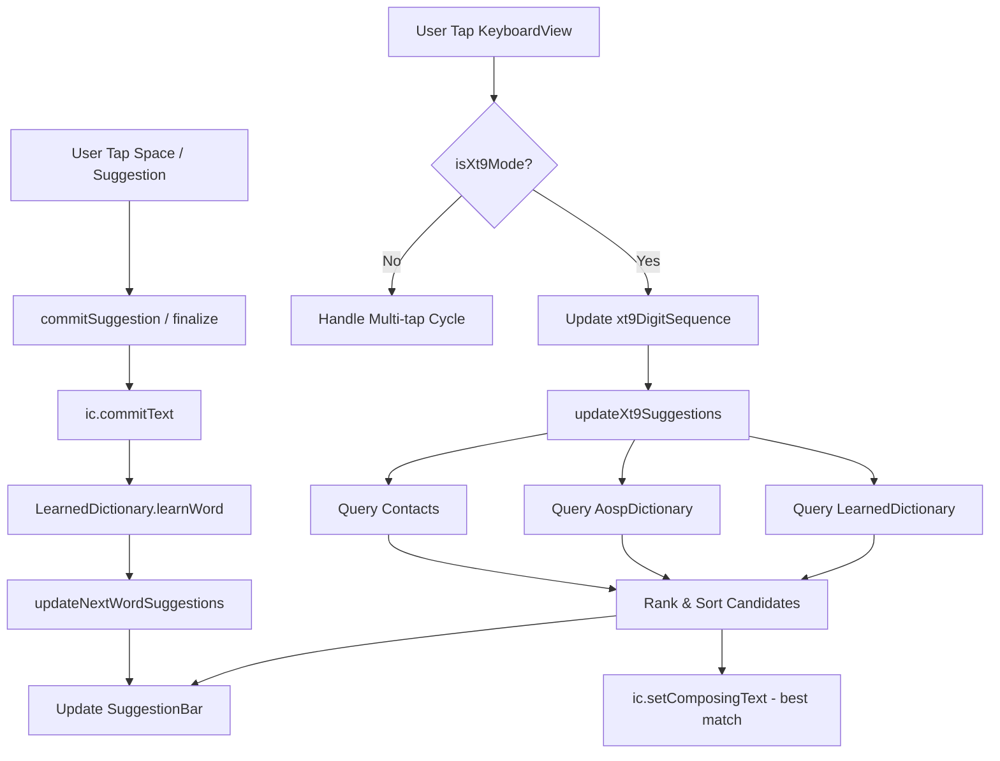

# T9 Keyboard Architecture

This document provides a comprehensive overview of the `com.musa.t9keyboard` architecture, documenting its components, data schema, and core logic flows.

---

## 1. Project Overview
T9 Keyboard is a modern Android Input Method Editor (IME) that implements both traditional multi-tap and predictive XT9-style input. It utilizes a custom View-based architecture (avoiding the deprecated `KeyboardView` API) and prioritizes efficiency and user customization through a card-based Settings UI.

---

## 2. Entry Points
As defined in `AndroidManifest.xml`:

| Component | Type | Responsibility |
| :--- | :--- | :--- |
| `.T9InputMethodService` | `Service` | The core IME engine. Handles lifecycle, input events, and view management. |
| `.MainActivity` | `Activity` | Launch activity. Redirects to `SettingsActivity` and ensures theme consistency. |
| `.SettingsActivity` | `Activity` | The user interface for configuring keyboard preferences. |

---

## 3. Component Documentation

### 3.1. Core Service & Logic

| Class | Responsibility | Direct Dependencies |
| :--- | :--- | :--- |
| `T9InputMethodService` | Orchestrates the entire IME. Manages view switching (Main, Symbols, Emoji, Edit), handles key events from views, coordinates prediction engine, and communicates with `InputConnection`. | `KeyboardView`, `SymbolsView`, `EmojiPickerView`, `TextEditingView`, `PreferencesManager`, `ShiftStateManager`, `AospDictionary`, `AospBigrams`, `LearnedDictionary`, `ContactsDictionary` |
| `ShiftStateManager` | Tracks and toggles between `OFF`, `ONE_SHOT`, and `CAPS_LOCK` states. Handles auto-capitalization logic. | None |
| `PreferencesManager` | Type-safe wrapper for `SharedPreferences` (file: `t9_prefs`). | `SharedPreferences` |

### 3.2. UI Components (Views)

| Class | Responsibility | Direct Dependencies |
| :--- | :--- | :--- |
| `KeyboardView` | The main T9 layout. Handles multi-tap timing, long-presses, and routes clicks to the service. Contains the `SuggestionBar`. | `KeyboardViewBinding`, `SuggestionBar`, `FontUtils` |
| `SuggestionBar` | Displays predicted candidates and toolbar actions (Settings, Edit, XT9 toggle). Uses a `RecyclerView` for suggestions. | `SuggestionBarBinding`, `FontUtils`, `RecyclerView` |
| `SymbolsView` | Grid-based layout for special characters and symbols. | `SymbolsViewBinding`, `FontUtils` |
| `EmojiPickerView` | Categorized emoji selector using `androidx.emoji2`. Manages recent emojis. | `PreferencesManager`, `EmojiData`, `FontUtils`, `EmojiCompat` |
| `TextEditingView` | Dedicated panel for cursor navigation (DPAD), selection, and clipboard operations (Cut/Copy/Paste). | `FontUtils` |

### 3.3. Dictionary & Data Engines

| Class | Responsibility | Direct Dependencies |
| :--- | :--- | :--- |
| `AospDictionary` | Static dictionary loaded from assets (`en_us_words.txt`). Provides base frequencies and prefix lookups via `TreeMap`. | `CoroutineContext (Dispatchers.IO)` |
| `LearnedDictionary` | Dynamic dictionary stored in `SharedPreferences` (`learned_words`). Learns user words and bigrams. Implements recency decay. | `SharedPreferences` |
| `AospBigrams` | Static next-word predictions loaded from assets (`en_us_bigrams.txt`). | `CoroutineContext (Dispatchers.IO)` |
| `ContactsDictionary` | Asynchronously loads contact names to provide personalized suggestions. | `ContentResolver` |

### 3.4. Utilities & Data Helpers

| Class | Responsibility | Direct Dependencies |
| :--- | :--- | :--- |
| `FontUtils` | Singleton to manage and provide the `Ubuntu` typeface from assets. | `AssetManager`, `Typeface` |
| `EmojiData` | Static data object containing emoji categories and character mappings. | `EmojiCategory` |

---

## 4. Data Schema

### 4.1. Persistence (SharedPreferences)

The application **does not use Room database**. All persistence is handled via `SharedPreferences` and static Asset files.

**File: `t9_prefs`**
| Key | Type | Default | Description |
| :--- | :--- | :--- | :--- |
| `haptic_enabled` | Boolean | `true` | Enables vibration on key press. |
| `haptic_duration` | Int | `30` | Vibration duration in ms. |
| `sound_enabled` | Boolean | `true` | Enables key click sounds. |
| `sound_volume` | Float | `0.5f` | Volume of click sounds (0.0 to 1.0). |
| `multi_tap_timeout` | Long | `800L` | Delay before committing a multi-tap character. |
| `key_font_size` | Int | `18` | Primary label size on keys (sp). |
| `suggestion_font_size`| Int | `16` | Font size for the suggestion bar (sp). |
| `theme` | Int | `2` | 0: Light, 1: Dark, 2: System. |
| `accent_color` | Int | `7` | Index into `accentColorResIds`. |
| `xt9_enabled` | Boolean | `false` | Enables predictive XT9 mode. |
| `deletion_speed` | Int | `100` | Speed of repeating backspace (0-100). |
| `contact_suggestions_enabled` | Boolean | `false` | Enables learning from contacts. |
| `emoji_size` | Int | `32` | Size of emoji in the picker (sp). |
| `recent_emojis` | String | `""` | Comma-separated list of recent emojis. |

**File: `learned_words`**
| Key Pattern | Type | Description |
| :--- | :--- | :--- |
| `freq_$word` | Int | Total count of times `$word` was committed. |
| `last_typed_$word` | Long | Timestamp of the last time `$word` was typed. |
| `next_${prev}__$next` | Int | Bigram frequency (count of `$next` following `$prev`). |

### 4.2. Kotlin Data Classes

| Class | Purpose | Properties |
| :--- | :--- | :--- |
| `WordEntry` | Models a single word from `AospDictionary`. | `stripped: String, frequency: Int, display: String` |
| `WordSuggestion` | Represents a candidate for the `SuggestionBar`. | `word: String, frequency: Int` |
| `EmojiCategory` | Defines an emoji category name and its icon. | `name: String, icon: String` |
| `ListItem` (Sealed) | Items for the `EmojiPickerView` RecyclerView. | `Header(name: String)`, `Emoji(code: String)` |
| `KeyConfig` (Private) | Configuration for keys in `TextEditingView`. | `label: String, textSize: Float, action: EditAction?, ...` |

### 4.3. Assets (Internal Dictionaries)
*   `en_us_words.txt`: Tab-separated (`word\tfrequency`).
*   `en_us_bigrams.txt`: Tab-separated (`word1\tword2\tfrequency`).

---

## 5. Input & Prediction Flow

### 5.1. Logical Flow (XT9 Mode)
1.  **Key Press**: User taps a key (e.g., '2' for ABC) in `KeyboardView`.
2.  **Event Routing**: `KeyboardView` triggers `onMultiTapListener`.
3.  **State Update**: `T9InputMethodService` appends the digit to `xt9DigitSequence`.
4.  **Prediction**: `updateXt9Suggestions()` is called:
    *   Queries `LearnedDictionary` for exact digit matches.
    *   Queries `AospDictionary` for exact digit matches.
    *   Queries `AospDictionary` for prefix/containing matches (if no exact matches).
    *   Queries `ContactsDictionary` if enabled.
5.  **Ranking**: Candidates are ranked: `AOSP Freq + (Learned Freq * Recency) + Bigram Boost`.
6.  **UI Update**: Best candidate is set as `composingText` in `InputConnection` and displayed as "anchored" in `SuggestionBar`. Other candidates populate the `RecyclerView`.
7.  **Commit**: User taps Space or a suggestion. `T9InputMethodService` calls `ic.commitText()`, clears buffers, and triggers `learnWord()`.

### 5.2. Mermaid Diagram

---

## 6. External Libraries

| Library | Usage | Direct Internal Interaction |
| :--- | :--- | :--- |
| `androidx.emoji2` | Handles emoji rendering and backward compatibility. | `T9InputMethodService`, `EmojiPickerView` |
| `kotlinx-coroutines` | Asynchronous dictionary loading and suggestion generation. | `T9InputMethodService`, `AospDictionary`, `AospBigrams` |
| `Material Components` | Used for `Slider` in `SettingsActivity`. | `SettingsActivity` |
| `ViewBinding` | Safe access to layout views. | `KeyboardView`, `SuggestionBar`, `SymbolsView`, `SettingsActivity` |

---

## 7. Technical Debt & Incomplete Areas

### 7.1. Known Limitations
*   **Method Length**: `T9InputMethodService` contains several excessively long methods (e.g., `handleEditAction` at ~150 lines, `handleAction` at ~70 lines) that should be refactored into command patterns or delegates.
*   **Hardcoded Timing**: The initial long-press delay is hardcoded to `150L` ms in several places (`KeyboardView`, `SymbolsView`, `EmojiPickerView`, `TextEditingView`).
*   **Search Functionality**: The search icon in `EmojiPickerView` is purely visual (`ic_search_heart`) and has no associated logic.

### 7.2. Flagged Items
*   **Multi-tap Finalization**: Logic in `handlePunctuationTap` and `handleLetterMultiTap` is complex and prone to edge-case bugs during rapid typing transition between letters and symbols.

---

## 8. Security & Privacy

The T9 Keyboard project prioritizes user privacy and data security. A comprehensive threat model and security audit was performed on April 3, 2026.

Key security measures implemented:
*   **Sensitive Input Suppression**: Automatic detection of password, numeric, and phone fields to disable word learning and suggestion generation.
*   **Data Retention Policy**: Enforced 180-day hard expiration for all user-learned words in the dictionary.
*   **Internal Telemetry**: Secure error logging with `CrashLogger` using private internal storage (`filesDir`).
*   **Scoped Permissions**: Minimal use of `READ_CONTACTS` with localized tokenization and clear user opt-out.

For detailed findings and mitigation strategies, see the [SECURITY_REPORT.md](SECURITY_REPORT.md).
